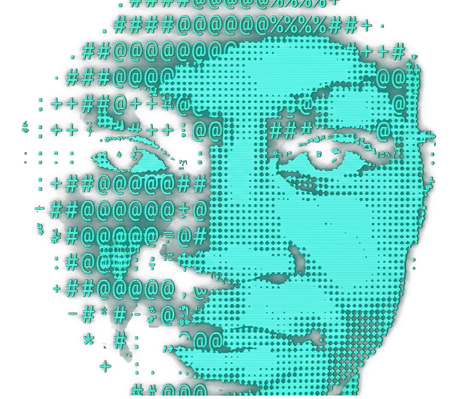
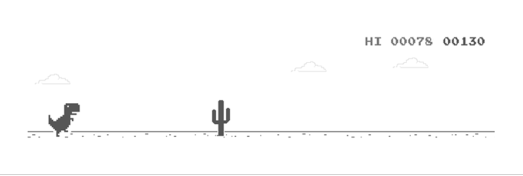

<div align="center">
  
</div>

<div align="left">
  
  <h1>Josué KENGNE</h1>
  <p>Aspiring Software Engineer</p>
</div>
<br/>

<div align="center">
  <a href="mailto:kenjosboy@gmail.com">
    
  </a>
  <a href="https://www.linkedin.com/in/pierre-josu%C3%A9-kengne-guepouoksi-69a97538a/">
    
  </a>
  <a href="https://instagram.com/theboystick/">
    
  </a>
  <a href="https://www.tiktok.com/@boyzbot_237">
    
  </a>
  <a href="https://discord.com/users/votre-profil">
    
  </a>
</div>

<br/>

<div align="center">
  
</div>

---

## About Me

```javascript
const josue = {
    name: "Josué KENGNE",
    title: "UI/UX Designer, Video and graphic Editor and aspiring Software Engineer",
    passions: ["Software Development", "Video Editing", "Graphic Design", "UI/UX Design", "Gaming"],
    currentFocus: "Building innovative digital solutions",
    funFact: "I turn ideas into design 💡 → 🎨"
};
```

---

## Tech Stack & Tools

### Programming Languages

<div align="center">
  
</div>

### Design & Creative

<div align="center">
  
</div>

### Frameworks & Tools

<div align="center">
  
</div>

---

## GitHub Stats

<div align="center">
  
</div>

---

## Featured Projects

<div align="center">

| Project | Description | Tech |
| --------- | ------------- | ------ |
| **Njangui+** | Community finance application built on an Access database for optimized management. | `Access` `Database` |
| **REST API Blog (INF222)** | University academic project - Building robust APIs. | `REST API` `Backend` |
| **Streamlit Dashboard (INF232)** | University academic project - Data visualization. | `Python` `Streamlit` |
| **Afiri** | Networking app for African students and graduates | `Figma` `UI/UX` |

</div>

---

## Current Goals

- I'm currently working on **improving my full-stack development skills**
- Ask me about **Flutter, UI/Design, Video Editing**
- Fun fact: **I believe in clean code and cleaner designs!**

---

<div align="center">
  
</div>

<div align="center">
  
</div>
